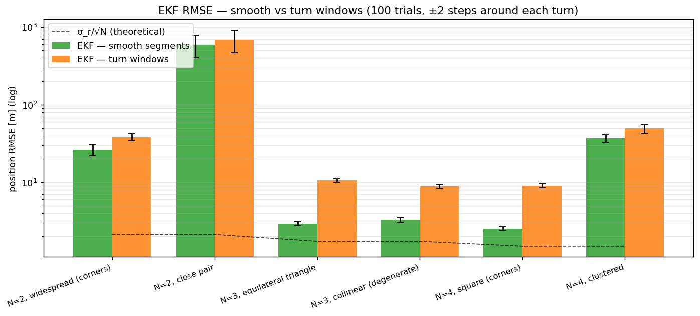
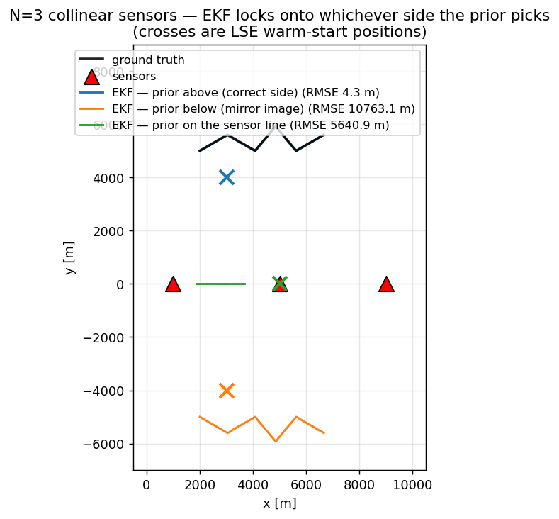
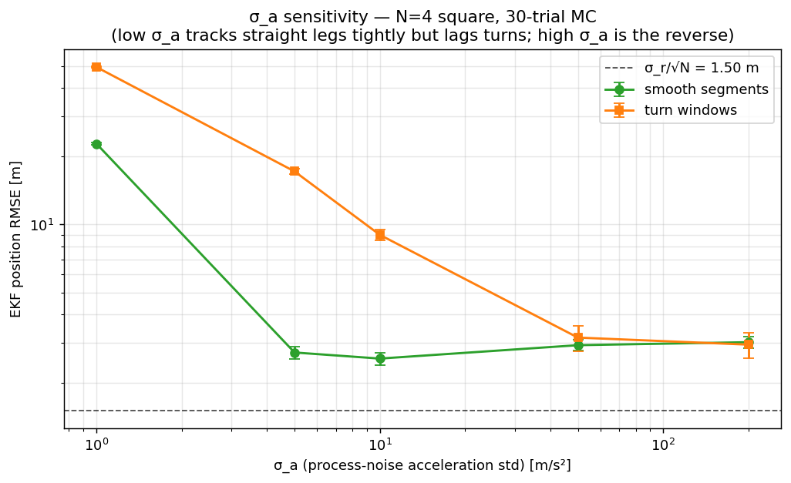

# MTH407 — Multi-Sensor TOA Target Localization & Tracking

> **Çoklu Sensörler ile Zaman Tabanlı Hedef Lokalizasyonu ve Takibi**
> MTH407 term project. 2D target tracking from time-of-arrival (TOA) measurements taken at multiple known-position sensors, using a least-squares initializer and a constant-velocity Extended Kalman Filter. Pure Python.


*Above: a 100 m/s target executing a four-turn zig-zag inside a 10 km × 10 km arena, observed by four corner sensors. Red triangles are sensors, dashed grey rings are each sensor's instantaneous range reading, the red `x` is the per-step LSE solution, and the blue ring is the EKF estimate with its 2σ uncertainty ellipse.*

---

## What this project does

Given `N ∈ {2, 3, 4}` sensors at known positions and TOA measurements with `σ_t = 10⁻⁸ s` (effective range noise `σ_r = 3 m`):

1. **Simulate** a known emission-time signal traveling from a moving target to each sensor, with Gaussian noise added in the time domain.
2. **Initialize** position and velocity via linearized least squares (LSE) — closed-form via a reference-equation subtraction for `N ≥ 3`, two-circle intersection for `N = 2`.
3. **Track** the target with a 4-state Constant-Velocity (CV) Extended Kalman Filter using stacked range innovations and Joseph-form covariance updates.
4. **Sweep** over six (sensor count, geometry) cells and quantify how geometry affects steady-state RMSE.
5. **Quantify** results with a 100-trial Monte Carlo per cell.

---

## Quickstart

```bash
git clone https://github.com/selcuko/mth407-toa-target-tracking.git
cd mth407-toa-target-tracking

python3 -m venv .venv
source .venv/bin/activate          # Windows: .venv\Scripts\activate
pip install -r requirements.txt

# Full pipeline (~4 minutes including animations)
python main.py

# Skip the slow GIF rendering during development
python main.py --no-anim
```

Outputs land in `output/figures/` (PNGs + GIFs) and `output/results/` (CSV summaries).

To explore interactively, open `notebooks/analysis.ipynb`.

---

## Repository layout

```
src/                        # core library
├── trajectory.py           # zig-zag generator (≥4 heading changes)
├── sensors.py              # six named geometries (corners, triangle, line, cluster, …)
├── measurements.py         # TOA simulation; time→range conversion
├── lse.py                  # 3+-sensor LSE; 2-sensor geometric intersection
├── ekf.py                  # CV-EKF, stacked range update, Joseph form
├── metrics.py              # RMSE, error helpers, plotting/IO utilities
└── animate.py              # multi-panel matplotlib FuncAnimation

experiments/
├── exp_baseline.py         # canonical N=4 square run, full plots
├── exp_geometry.py         # 6-cell sensor-geometry sweep
├── exp_monte_carlo.py      # 100-trial MC × 6 cells with summary CSV
└── exp_animation.py        # render simulation GIFs for each cell

notebooks/analysis.ipynb    # narrative walkthrough of methods + results
main.py                     # runs all four experiments end-to-end
```

---

## Math, briefly

**TOA measurement model** (sensor `i`, step `k`):

```
z_iᵏ = tᵏ + ‖pᵏ − sᵢ‖ / c + nᵢᵏ,        nᵢᵏ ~ N(0, σ_t²)
```

Internally we simulate noise in the time domain (faithful to the physics) and convert to range at the LSE/EKF boundary: `rᵢᵏ = c · (z_iᵏ − tᵏ)`.

**LSE for N ≥ 3** uses the reference-equation trick:

```
rᵢ² − r_ref² = ‖s_ref‖² − ‖sᵢ‖² + 2 (sᵢ − s_ref)ᵀ p
```

Stacked into `A p = b` and solved by pseudo-inverse.

**EKF state** `x = [pₓ, p_y, vₓ, v_y]ᵀ` with CV transition `F(T)` and discrete white-acceleration `Q(σ_a)`. Per-sensor measurement Jacobian:

```
Hᵢ = [(p − sᵢ)ᵀ / rᵢ,   0,   0]   (1 × 4)
```

Update is Joseph-form for numerical stability.

---

## Geometry sweep

| `N` | Geometry A (favorable)             | Geometry B (degraded)                     |
|----:|------------------------------------|-------------------------------------------|
|   2 | Wide-spread (opposite corners)     | Close pair on one edge                    |
|   3 | Equilateral triangle around arena  | Collinear sensors                         |
|   4 | Square at arena corners            | Clustered on one side                     |

### Headline results (100-trial Monte Carlo)

`σ_r/√N` is the theoretical lower bound assuming good GDOP. *Smooth* averages over steady-state steps between turns; *turn* averages over a 4-step window after each of the four heading changes.

| Cell                        | EKF overall [m]    | EKF smooth [m]   | EKF turns [m]    |
|-----------------------------|--------------------|------------------|------------------|
| N=2, widespread (corners)   |   28.37 ± 3.57     |   26.33 ± 4.26   |   38.29 ± 3.91   |
| N=2, close pair             |  605.00 ± 194.11   |  589.75 ± 190.11 |  691.44 ± 221.63 |
| N=3, equilateral triangle   |    4.76 ± 0.18     |    2.92 ± 0.17   |   10.54 ± 0.57   |
| N=3, collinear              |    4.48 ± 0.18     |    3.28 ± 0.22   |    8.84 ± 0.46   |
| N=4, square (corners)       |    4.10 ± 0.17     |    2.52 ± 0.13   |    9.07 ± 0.51   |
| N=4, clustered              |   38.95 ± 3.84     |   36.90 ± 3.92   |   49.55 ± 6.60   |

For `N=4` square the smooth-segment RMSE is **2.52 m** — within 1.7× of the σ_r/√N = 1.5 m bound. The remaining ~1 m gap is real-finite-filter overhead; the 9 m turn-window number reflects the unmodelled-maneuver story below, not measurement noise.




---

## Findings worth highlighting

- **Geometry dominates.** For `N=4` square the steady-state RMSE is ~4 m; clustering the same four sensors on one side blows it up to ~40 m, a 10× penalty from GDOP alone.
- **`N=2` widespread is fine, close pair is hopeless.** With well-separated baselines a two-sensor configuration tracks within ~30 m. Cluster the pair and the two-circle intersection becomes an ill-conditioned mess (>500 m RMSE).
- **The CV-EKF lags every heading change.** The smooth-segment EKF RMSE for `N=4` square is 2.5 m (close to the σ_r/√N = 1.5 m bound); over the 4-step window after each of the four turns it climbs to 9 m. The single overall RMSE blends those two regimes and obscures both.
- **`N=3` collinear is *not* catastrophic — but it is fragile.** The classical mirror-image ambiguity (any point and its reflection across the sensor line produce identical ranges) is broken in our default setup by the LSE warm-start prior. If the prior is on the wrong side, the EKF locks onto the mirror image and the RMSE explodes to over **10 km** — see the stress test below.
- **Per-step LSE can match or beat the EKF on *overall* RMSE** in well-conditioned cells, because turn-window lag dominates the blended metric. On the smooth-segment metric the EKF wins comfortably (~2.5 m vs ~3 m). The EKF *decisively* wins on the `N=2` widespread case (28 m vs 573 m) — the LSE has fragile two-circle outliers that the filter's prior smooths out.

The error-vs-time plot makes the turn-lag story obvious — see `output/figures/mc_error_vs_time.png` for the full panel grid.

---

## Stress tests & sensitivity

### N=3 collinear — the prior is doing the heavy lifting

`experiments/exp_collinear_stress.py` runs the collinear cell with three different LSE warm-start priors:

| Prior position           | LSE RMSE [m]       | EKF RMSE [m]       |
|--------------------------|--------------------|--------------------|
| above (correct side)     |    3.89            |    4.31            |
| below (mirror image)     |  10 763.05         |  10 763.11         |
| on the sensor line       |   5 640.96         |   5 640.94         |

When the prior is on the same side of the sensor line as the target, the geometry behaves almost as well as the equilateral triangle. With a wrong-side prior, the LSE converges to the mirror image and the EKF locks onto it forever — the velocity finite-difference at initialization keeps it pointing the wrong way, and there is no measurement-side information that can distinguish the two solutions. This is the classical sensor-line degeneracy, just hidden by the prior in our default configuration.



### σ_a sensitivity — tuning the CV process noise

`experiments/exp_sigma_a_sweep.py` sweeps the EKF process-noise acceleration std on `N=4` square (30-trial MC each):

| `σ_a` [m/s²] | Smooth RMSE [m]   | Turn RMSE [m]    |
|------------:|-------------------|------------------|
|        1.0 |   22.68 ± 0.21    |   49.42 ± 0.42   |
|        5.0 |    2.72 ± 0.16    |   17.11 ± 0.46   |
|       10.0 |    2.55 ± 0.16    |    8.98 ± 0.46   |
|       50.0 |    2.93 ± 0.16    |    3.16 ± 0.41   |
|      200.0 |    3.02 ± 0.17    |    2.94 ± 0.38   |

The trade-off is monotonic: too-stiff filters (`σ_a = 1`) cannot keep up with the maneuvers and accumulate huge errors; too-loose filters (`σ_a ≥ 50`) trade smooth-segment precision for turn responsiveness. The default `σ_a = 10` sits at a reasonable knee on the smooth side — but if turn responsiveness mattered more than baseline noise (e.g., a maneuvering threat), `σ_a ∈ [50, 100]` would be a better choice. A proper IMM filter would dominate this whole curve, but is out of scope here.



---

## Constants

| Symbol  | Value              | Meaning                            |
|---------|--------------------|------------------------------------|
| `c`     | 3·10⁸ m/s          | Signal speed                       |
| `σ_t`   | 10⁻⁸ s             | Time-measurement std               |
| `σ_r`   | 3 m                | Effective range-noise std (`c·σ_t`)|
| `T`     | 0.5 s              | Sample period                      |
| Duration| 60 s (121 steps)   | Trajectory length                  |
| Arena   | 10 km × 10 km      | Surveillance area                  |
| Speed   | 100 m/s            | Target speed                       |
| `σ_a`   | 10 m/s²            | Process-noise acceleration std     |

---

## Requirements

Python ≥ 3.10. Dependencies (`requirements.txt`): `numpy`, `scipy`, `matplotlib`, `jupyter`. No MATLAB, no proprietary toolboxes.

---

## Course

**MTH407** — term project, 2D multi-sensor target localization and tracking via time-based measurements.

## License

MIT.
