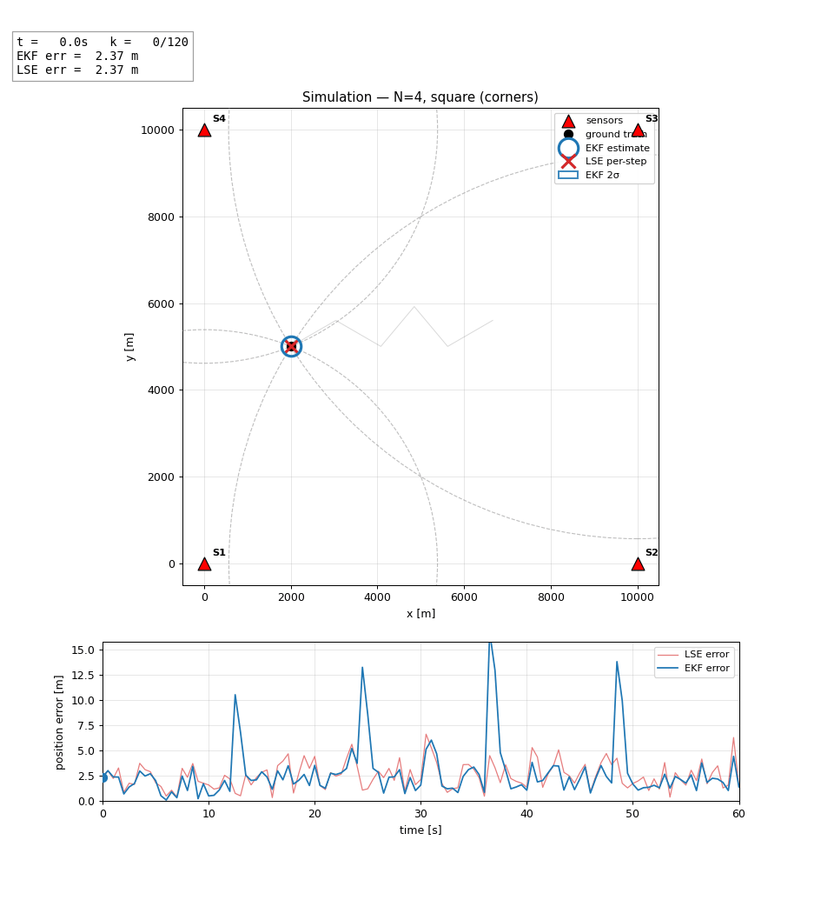
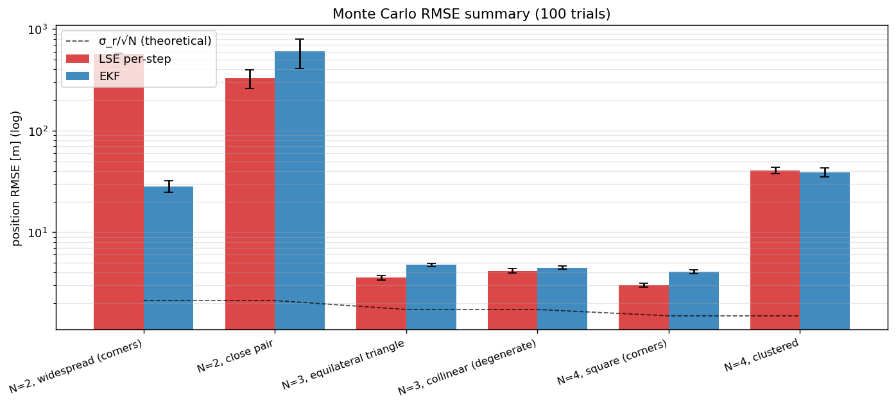

# MTH407 — Multi-Sensor TOA Target Localization & Tracking

> **Çoklu Sensörler ile Zaman Tabanlı Hedef Lokalizasyonu ve Takibi**
> MTH407 term project. 2D target tracking from time-of-arrival (TOA) measurements taken at multiple known-position sensors, using a least-squares initializer and a constant-velocity Extended Kalman Filter. Pure Python.



*Above: a 100 m/s target executing a four-turn zig-zag inside a 10 km × 10 km arena, observed by four corner sensors. Red triangles are sensors, dashed grey rings are each sensor's instantaneous range reading, the red `x` is the per-step LSE solution, and the blue ring is the EKF estimate with its 2σ uncertainty ellipse.*

---

## What this project does

Given `N ∈ {2, 3, 4}` sensors at known positions and TOA measurements with `σ_t = 10⁻⁸ s` (effective range noise `σ_r = 3 m`):

1. **Simulate** a known emission-time signal traveling from a moving target to each sensor, with Gaussian noise added in the time domain.
2. **Initialize** position and velocity via linearized least squares (LSE) — closed-form via a reference-equation subtraction for `N ≥ 3`, two-circle intersection for `N = 2`.
3. **Track** the target with a 4-state Constant-Velocity (CV) Extended Kalman Filter using stacked range innovations and Joseph-form covariance updates.
4. **Sweep** over six (sensor count, geometry) cells and quantify how geometry affects steady-state RMSE.
5. **Quantify** results with a 100-trial Monte Carlo per cell.

---

## Quickstart

```bash
git clone https://github.com/selcuko/mth407-toa-target-tracking.git
cd mth407-toa-target-tracking

python3 -m venv .venv
source .venv/bin/activate          # Windows: .venv\Scripts\activate
pip install -r requirements.txt

# Full pipeline (~4 minutes including animations)
python main.py

# Skip the slow GIF rendering during development
python main.py --no-anim
```

Outputs land in `output/figures/` (PNGs + GIFs) and `output/results/` (CSV summaries).

To explore interactively, open `notebooks/analysis.ipynb`.

---

## Repository layout

```
src/                        # core library
├── trajectory.py           # zig-zag generator (≥4 heading changes)
├── sensors.py              # six named geometries (corners, triangle, line, cluster, …)
├── measurements.py         # TOA simulation; time→range conversion
├── lse.py                  # 3+-sensor LSE; 2-sensor geometric intersection
├── ekf.py                  # CV-EKF, stacked range update, Joseph form
├── metrics.py              # RMSE, error helpers, plotting/IO utilities
└── animate.py              # multi-panel matplotlib FuncAnimation

experiments/
├── exp_baseline.py         # canonical N=4 square run, full plots
├── exp_geometry.py         # 6-cell sensor-geometry sweep
├── exp_monte_carlo.py      # 100-trial MC × 6 cells with summary CSV
└── exp_animation.py        # render simulation GIFs for each cell

notebooks/analysis.ipynb    # narrative walkthrough of methods + results
main.py                     # runs all four experiments end-to-end
```

---

## Math, briefly

**TOA measurement model** (sensor `i`, step `k`):

```
z_iᵏ = tᵏ + ‖pᵏ − sᵢ‖ / c + nᵢᵏ,        nᵢᵏ ~ N(0, σ_t²)
```

Internally we simulate noise in the time domain (faithful to the physics) and convert to range at the LSE/EKF boundary: `rᵢᵏ = c · (z_iᵏ − tᵏ)`.

**LSE for N ≥ 3** uses the reference-equation trick:

```
rᵢ² − r_ref² = ‖s_ref‖² − ‖sᵢ‖² + 2 (sᵢ − s_ref)ᵀ p
```

Stacked into `A p = b` and solved by pseudo-inverse.

**EKF state** `x = [pₓ, p_y, vₓ, v_y]ᵀ` with CV transition `F(T)` and discrete white-acceleration `Q(σ_a)`. Per-sensor measurement Jacobian:

```
Hᵢ = [(p − sᵢ)ᵀ / rᵢ,   0,   0]   (1 × 4)
```

Update is Joseph-form for numerical stability.

---

## Geometry sweep

| `N` | Geometry A (favorable)             | Geometry B (degraded)                     |
|----:|------------------------------------|-------------------------------------------|
|   2 | Wide-spread (opposite corners)     | Close pair on one edge                    |
|   3 | Equilateral triangle around arena  | Collinear sensors                         |
|   4 | Square at arena corners            | Clustered on one side                     |

### Headline results (100-trial Monte Carlo, steady-state RMSE)

| Cell                        | LSE per-step [m]   | EKF [m]            |
|-----------------------------|--------------------|--------------------|
| N=2, widespread (corners)   |  573.46 ± 2.58     |  28.37 ± 3.57      |
| N=2, close pair             |  326.49 ± 67.52    |  605.00 ± 194.11   |
| N=3, equilateral triangle   |    3.56 ± 0.17     |   4.76 ± 0.18      |
| N=3, collinear              |    4.16 ± 0.22     |   4.48 ± 0.18      |
| N=4, square (corners)       |    3.01 ± 0.12     |   4.10 ± 0.17      |
| N=4, clustered              |   40.44 ± 2.85     |  38.95 ± 3.84      |



---

## Findings worth highlighting

- **Geometry dominates** — for `N=4` square the steady-state RMSE is ~4 m; clustering the same four sensors on one side blows it up to ~40 m, a 10× penalty from GDOP alone.
- **`N=2` widespread is fine, close pair is hopeless.** With well-separated baselines a two-sensor configuration tracks within ~30 m. Cluster the pair and the two-circle intersection becomes an ill-conditioned mess (>500 m RMSE).
- **`N=3` collinear is *not* catastrophic in this setup.** The classical mirror-image ambiguity is broken by the LSE prior + EKF velocity term, so the collinear cell tracks within a few meters of the equilateral case. (A target crossing the sensor line would expose the degeneracy — out of scope here.)
- **Per-step LSE can match or beat the EKF on overall RMSE** in well-conditioned cells. The CV-EKF's smoothing benefit during straight segments is offset by lag at each of the four ~70° heading changes — each turn produces a `v · T ≈ 50 m` prediction error that takes several steps to wash out. Where the EKF *decisively* wins is on the `N=2` widespread case, where LSE has fragile two-circle outliers and the filter's prior smooths them out (28 m vs 573 m).

The error-vs-time plot makes the turn-lag story obvious — see `output/figures/mc_error_vs_time.png` for the full panel grid.

---

## Constants

| Symbol  | Value              | Meaning                            |
|---------|--------------------|------------------------------------|
| `c`     | 3·10⁸ m/s          | Signal speed                       |
| `σ_t`   | 10⁻⁸ s             | Time-measurement std               |
| `σ_r`   | 3 m                | Effective range-noise std (`c·σ_t`)|
| `T`     | 0.5 s              | Sample period                      |
| Duration| 60 s (121 steps)   | Trajectory length                  |
| Arena   | 10 km × 10 km      | Surveillance area                  |
| Speed   | 100 m/s            | Target speed                       |
| `σ_a`   | 10 m/s²            | Process-noise acceleration std     |

---

## Requirements

Python ≥ 3.10. Dependencies (`requirements.txt`): `numpy`, `scipy`, `matplotlib`, `jupyter`. No MATLAB, no proprietary toolboxes.

---

## Course

**MTH407** — term project, 2D multi-sensor target localization and tracking via time-based measurements.

## License

MIT.
